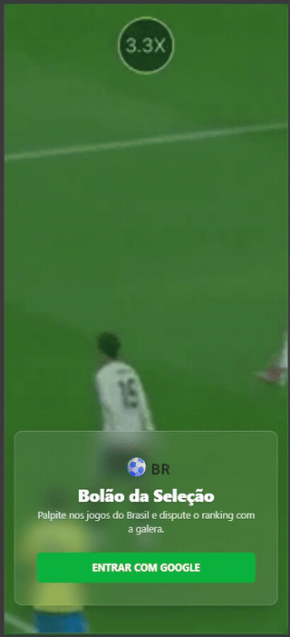
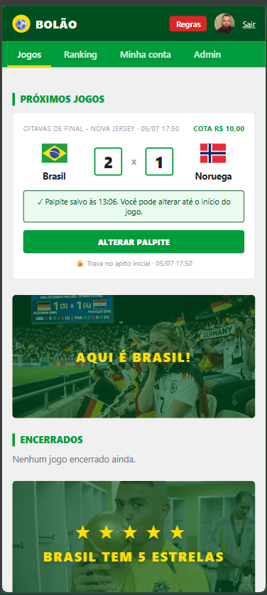

# ⚽🇧🇷 Bolão da Seleção

> Palpite nos jogos da Seleção Brasileira, acompanhe o placar **ao vivo** e dispute o ranking com a galera — com direito a prêmio via Pix pra quem cravar.

<p>
  
  
  
  
  
  
  
</p>

🔗 **Produção:** [bolao.jeansilva.app.br](https://bolao.jeansilva.app.br)

<table>
  <tr>
    <td align="center" width="50%">
      <br>
      <sub><b>Demo</b> — navegação no app</sub>
    </td>
    <td align="center" width="50%">
      <br>
      <sub><b>Home</b> — próximos jogos e palpite</sub>
    </td>
  </tr>
</table>

---

## Sumário

- [O que é](#o-que-é)
- [Funcionalidades](#funcionalidades)
- [Stack](#stack)
- [Arquitetura](#arquitetura)
- [Regras de negócio](#regras-de-negócio)
- [API](#api)
- [Rodando localmente](#rodando-localmente)
- [Variáveis de ambiente](#variáveis-de-ambiente)
- [Testes](#testes)
- [Build & Docker](#build--docker)
- [Deploy (CI/CD)](#deploy-cicd)
- [Estrutura do projeto](#estrutura-do-projeto)
- [Licença](#licença)

---

## O que é

Bolão web para os jogos do Brasil. O usuário entra com a conta Google, registra o
palpite de placar de cada jogo e ganha pontos conforme acerta. Durante a partida,
um **placar ao vivo** atualiza a classificação em tempo real via WebSocket — dá pra
ver quem ainda está na disputa e quem já foi eliminado a cada gol. No fim da rodada,
o perdedor paga o vencedor via Pix, seguindo a cota configurada para o jogo.

## Funcionalidades

- 🔐 **Login com Google** (Firebase Authentication) e perfil com chave Pix.
- 📝 **Palpites** de placar por jogo, com trava no horário do apito inicial.
- 🟢 **Placar ao vivo** por WebSocket: classificação e eliminação recalculadas a cada atualização.
- 🏆 **Ranking** geral acumulado e leaderboard por partida.
- 💸 **Regra de prêmio**: cota por jogo, rateio automático entre os vencedores (perdedor → vencedor via Pix).
- 🎉 **Tela de vencedor** com confete para quem crava o placar.
- 🛠️ **Painel de administração**: criar/editar/remover jogos, controlar o placar ao vivo e encerrar a partida — restrito por e-mail.
- 📱 **Mobile-first**, com carrossel da Seleção e bandeiras dos países.

## Stack

| Camada | Tecnologia |
|---|---|
| Framework | **Next.js 15** (App Router, React Server + Client Components, output `standalone`) |
| Linguagem | **TypeScript** (`strict`) |
| UI | **React 18** + **Tailwind CSS 3.4** |
| Auth | **Firebase Authentication** (Google) — verificação de ID token no servidor via **firebase-admin** |
| Dados | **Cloud Firestore** (via firebase-admin no servidor) |
| Tempo real | **Socket.IO client** conectado a um serviço de WebSocket externo |
| Testes | **Vitest** + **Testing Library** + **jsdom** |
| Empacotamento | **Docker** multi-stage (Node 22, Debian slim) |
| CI/CD | **GitHub Actions** → **GHCR** → **VPS** (SSH + Docker Compose) |

## Arquitetura

```
Navegador (React/Next client)
   │  Firebase Auth (Google) → ID token
   │  fetch com Bearer <token>
   ▼
Next.js API Routes (server)  ──verifyIdToken──►  Firebase Admin ──►  Firestore
   │
   │  ao gravar placar (admin): POST best-effort
   ▼
Serviço WebSocket (ws.jeansilva.app.br)  ──broadcast match_update──►  clientes na sala match:<id>
```

Pontos de design que valem destacar:

- **Fronteira de confiança no servidor.** Toda rota de API valida o **ID token do
  Firebase** (`Authorization: Bearer …`) via `requireUser`/`requireAdmin`
  ([src/lib/auth.ts](src/lib/auth.ts)). O cliente nunca fala direto com o Firestore;
  quem lê/escreve é o firebase-admin no servidor.
- **Admin por allowlist.** Acesso administrativo é decidido por `ADMIN_EMAILS`
  (lista separada por vírgula), não por flag no banco — simples e auditável.
- **Tempo real desacoplado e best-effort.** Ao atualizar um placar, o servidor
  apenas *notifica* o serviço de WebSocket ([src/lib/wsNotify.ts](src/lib/wsNotify.ts)).
  Se a notificação falhar, o placar **já foi persistido** — a falha é logada e
  ignorada, sem quebrar a request. Sem as envs de WS, vira no-op.
- **Segredos fora do bundle.** As `NEXT_PUBLIC_*` (config do cliente Firebase) são
  inlinadas em **build-time**; os segredos de servidor (`FIREBASE_ADMIN_*`,
  `WS_API_KEY`) só existem em **runtime**, injetados via `--env-file`.
- **Lógica de domínio pura e testável.** Pontuação, eliminação e rateio ficam em
  módulos puros ([scoring.ts](src/lib/scoring.ts), [leaderboard.ts](src/lib/leaderboard.ts),
  [round.ts](src/lib/round.ts)), sem dependência de I/O — daí a cobertura de testes ser alta e barata.

## Regras de negócio

**Pontuação de um palpite** ([src/lib/scoring.ts](src/lib/scoring.ts)):

| Situação | Pontos |
|---|---|
| Cravou o placar exato | **3** |
| Acertou só o resultado (vitória/empate/derrota) | **1** |
| Errou o resultado | **0** |
| Jogo decidido nos pênaltis: acertou o vencedor | **1** (placar exato não conta) |
| Pênaltis empatados | 0 (ninguém pontua) |

**Eliminação ao vivo** ([src/lib/leaderboard.ts](src/lib/leaderboard.ts)):
um palpiteiro é eliminado quando **não pode mais cravar o placar exato** *e* o
resultado corrente já está contra o palpite dele. O leaderboard ordena por
eliminados por último → mais pontos → maior proximidade do placar → nome (desempate estável).

**Prêmio da rodada** ([src/lib/round.ts](src/lib/round.ts)):
vencem os que fizerem a maior pontuação. Cada perdedor paga a **cota** do jogo; o
total arrecadado é rateado igualmente entre os vencedores (`perWinner`), pago via
**Pix** para a chave cadastrada no perfil.

## API

Todas as rotas exigem `Authorization: Bearer <firebase-id-token>`. As rotas `admin`
exigem, além disso, e-mail presente em `ADMIN_EMAILS`.

| Método | Rota | Descrição | Acesso |
|---|---|---|---|
| `GET` | `/api/me` | Perfil do usuário autenticado | usuário |
| `PUT` | `/api/me` | Atualiza o perfil (ex.: chave Pix) | usuário |
| `GET` | `/api/matches` | Lista os jogos | usuário |
| `GET` | `/api/matches/{id}` | Detalhe do jogo + palpites | usuário |
| `POST` | `/api/matches/{id}/bet` | Cria/atualiza o palpite | usuário |
| `GET` | `/api/ranking` | Ranking geral | usuário |
| `POST` | `/api/admin/matches` | Cria um jogo | admin |
| `PUT` | `/api/admin/matches/{id}` | Edita um jogo | admin |
| `DELETE` | `/api/admin/matches/{id}` | Remove um jogo | admin |
| `POST` | `/api/admin/matches/{id}/live` | Atualiza o placar ao vivo | admin |
| `POST` | `/api/admin/matches/{id}/result` | Encerra e finaliza o resultado | admin |

## Rodando localmente

**Pré-requisitos:** Node.js **22+** (o `firebase-admin@14` exige `node >= 22`) e npm.

```bash
# 1. Instalar dependências
npm ci

# 2. Configurar o ambiente
cp .env.example .env.local
#    preencha os valores (veja a seção abaixo)

# 3. Subir em desenvolvimento
npm run dev
# → http://localhost:3000
```

Você vai precisar de um projeto **Firebase** com Authentication (provedor Google)
habilitado e uma **service account** para o firebase-admin. Para o placar ao vivo
funcionar localmente, aponte `NEXT_PUBLIC_WS_URL`/`WS_PUBLISH_URL` para uma instância
do serviço de WebSocket — sem elas, o app funciona normalmente, só sem tempo real.

## Variáveis de ambiente

Baseado em [.env.example](.env.example):

| Variável | Escopo | Descrição |
|---|---|---|
| `NEXT_PUBLIC_FIREBASE_API_KEY` | cliente (build-time) | Config pública do Firebase |
| `NEXT_PUBLIC_FIREBASE_AUTH_DOMAIN` | cliente (build-time) | Domínio de auth do Firebase |
| `NEXT_PUBLIC_FIREBASE_PROJECT_ID` | cliente (build-time) | Project ID do Firebase |
| `NEXT_PUBLIC_FIREBASE_APP_ID` | cliente (build-time) | App ID do Firebase |
| `NEXT_PUBLIC_WS_URL` | cliente (build-time) | URL do WebSocket que o cliente conecta |
| `WS_PUBLISH_URL` | servidor (runtime) | Endpoint de publish server→WS |
| `WS_API_KEY` | servidor (runtime) 🔒 | API key do serviço de WebSocket |
| `FIREBASE_ADMIN_PROJECT_ID` | servidor (runtime) 🔒 | Service account — project id |
| `FIREBASE_ADMIN_CLIENT_EMAIL` | servidor (runtime) 🔒 | Service account — client email |
| `FIREBASE_ADMIN_PRIVATE_KEY` | servidor (runtime) 🔒 | Service account — private key |
| `ADMIN_EMAILS` | servidor (runtime) | E-mails com acesso admin (separados por vírgula) |
| `PORT` | servidor | Porta do Next (dev `3000`, prod `3002`) |

> 🔒 = **segredo**. Nunca commitar; em produção entra via `--env-file`/secrets do CI,
> jamais embutido na imagem. As `NEXT_PUBLIC_*` são públicas por natureza (vão pro bundle).

## Testes

Suíte com **Vitest** + **Testing Library** cobrindo lógica de domínio, rotas de API,
hooks e componentes (32 arquivos de teste).

```bash
npm test          # roda toda a suíte uma vez
npm run test:watch # modo watch
npx tsc --noEmit  # checagem de tipos (mesma do CI)
```

> ℹ️ A primeira execução do `npm test` ocasionalmente reporta "no tests" por
> flakiness do runner — basta rodar de novo.

## Build & Docker

```bash
npm run build   # build de produção (Next standalone)
npm start       # sobe o build (usa $PORT, padrão 3000)
```

O [Dockerfile](Dockerfile) faz um build **multi-stage** (deps → builder → runner)
sobre `node:22-bookworm-slim`, aproveitando o output `standalone` do Next e rodando
como usuário **não-root**. As `NEXT_PUBLIC_*` são passadas como `--build-arg`
(inlinadas no bundle); os segredos de servidor entram só em runtime.

```bash
docker build -t bolao-brasil \
  --build-arg NEXT_PUBLIC_FIREBASE_API_KEY=... \
  --build-arg NEXT_PUBLIC_FIREBASE_PROJECT_ID=... \
  # ...demais NEXT_PUBLIC_*
  .

docker run --rm -p 3002:3002 --env-file ./bolao.env bolao-brasil
```

## Deploy (CI/CD)

Deploy é **automático a cada push no `master`**, orquestrado pelo GitHub Actions
([.github/workflows/deploy.yml](.github/workflows/deploy.yml)):

```
push master
   │
   ├─▶ test           npm ci → tsc --noEmit → npm test
   │
   ├─▶ build-and-push build Docker → push no GHCR
   │                  tags: latest + sha-<short>
   │
   └─▶ deploy         scp docker-compose.yml → VPS
                      ssh: docker compose pull && up -d && image prune
```

Em produção, o app roda num **VPS (Bitnami)** via [docker-compose.yml](docker-compose.yml),
publicado só no loopback (`127.0.0.1:3002`); o **Apache** do Bitnami faz o proxy de
`bolao.jeansilva.app.br` → `127.0.0.1:3002`. A `IMAGE_TAG` é gravada pelo CI a cada
deploy, e `concurrency` evita dois deploys simultâneos se pisando.

## Estrutura do projeto

```
src/
├── app/
│   ├── (protected)/          # rotas autenticadas: home, jogo/[id], ranking, conta, admin
│   ├── api/                  # rotas de API (matches, bet, me, ranking, admin/*)
│   ├── login/                # tela de login (Google)
│   └── layout.tsx
├── components/               # UI: MatchCard, LiveLeaderboard, WinnerScreen, Header, ...
├── context/AuthProvider.tsx  # estado de auth (Firebase) no cliente
├── hooks/                    # useMatchLive, useMatchesLive, useRequireProfile
└── lib/                      # domínio puro (scoring, leaderboard, round) + infra
                              # (auth, firebaseAdmin, firebaseClient, wsNotify, apiClient)
tests/                        # espelha src/ (Vitest + Testing Library)
```

## Licença

Projeto privado. Todos os direitos reservados.
